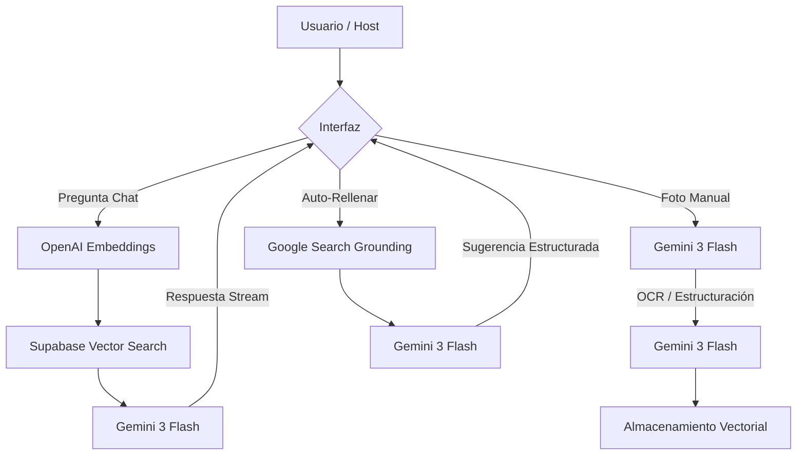

# Documentación de Suministro de IA - GuideFlow

Este documento detalla el uso de las diferentes APIs de Inteligencia Artificial integradas en el proyecto GuideFlow, sus modelos y su propósito específico.

## 1. Anthropic (Claude 3)
Utilizado como el motor principal de razonamiento y generación de texto.

*   **Modelo:** `claude-3-haiku-20240307` (Elegido por su balance entre latencia ultra-baja y precisión).
*   **Funcionalidades:**
    *   **Asistente Digital (Chat):** Responde preguntas de huéspedes basadas en el contexto de la propiedad (`/api/chat`).
    *   **Sugeridor de Contenido (Magic Fill):** Genera información real sobre transporte, restaurantes, FAQs y equipamiento basado en la ubicación de la propiedad (`/api/ai-fill-context`).
    *   **Extracción de Datos:** Procesa texto extraído de manuales para estructurarlo.

## 2. OpenAI
Utilizado para la infraestructura de búsqueda semántica (RAG).

*   **Modelo:** `text-embedding-3-small`.
*   **Funcionalidades:**
    *   **Búsqueda Unificada:** Genera vectores (embeddings) de 1536 dimensiones para manuales, FAQs y contexto de la propiedad.
    *   **Recuperación (Retreival):** Permite que el chat encuentre la información más relevante en milisegundos mediante comparación vectorial en Supabase (`pgvector`).

## 3. Google Gemini (Vision/OCR/Generation)
Utilizado para el procesamiento de imágenes, documentos complejos y generación de texto optimizada.

*   **Modelos:** `gemini-3-flash` (Principal) / `gemini-3-pro` (Análisis avanzado).
*   **Funcionalidades:**
    *   **Escáner Visual:** Analiza fotos de manuales físicos o electrodomésticos para identificar modelos y extraer instrucciones de uso (`lib/ai/gemini-rest.ts`).
    *   **Generación de Texto:** Procesa consultas de chat y auto-rellenado de contexto con baja latencia y coste reducido.
    *   **Búsqueda con Grounding:** Utiliza la búsqueda de Google integrada para validar datos reales.

## 4. Brave Search API
Utilizado para la veracidad de datos externos.

*   **Funcionalidad:**
    *   **Grounding Local:** Proporciona datos en tiempo real sobre negocios locales, horarios y precios para asegurar que las recomendaciones de la IA sean vigentes y reales (`lib/ai/brave.ts`).

---

## Arquitectura de Flujo de IA (Optimizada)

